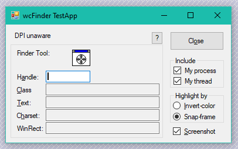
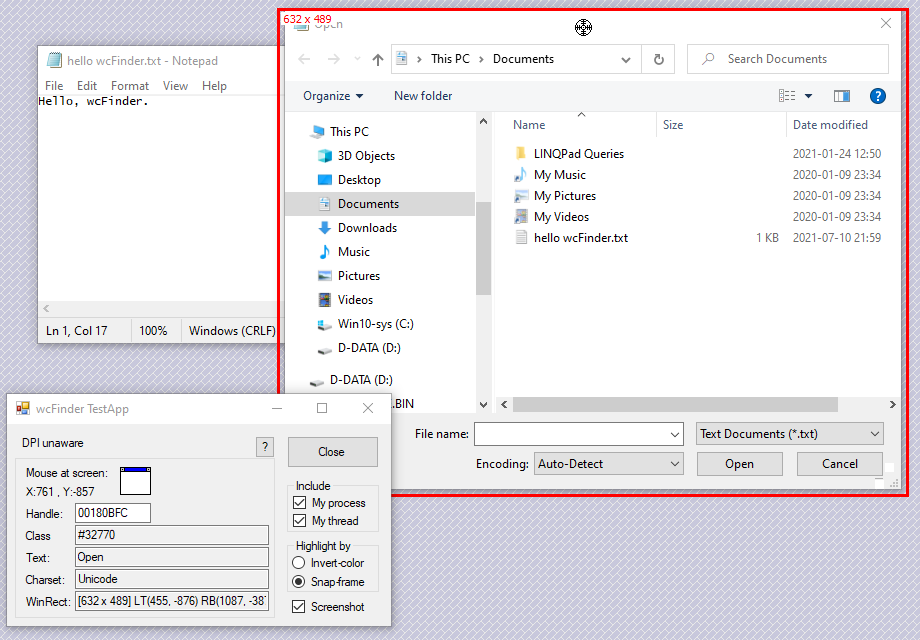

Window Finder Control (wcFinder)
--------------------------------

A .NET control that behaves like the Spy++ window finder tool, allowing the
user to select a top-level window or child window by dragging a crosshair icon over it.

In June 2021, wcFinder receives a major upgrade with the following features:

* Introduce a new target-window highlighting method called **Snap-frame**. 
  This new method works with Win7+ DWM-rendered top-level window, 
  while the old method(called **Invert-color** as used by Spy++) does not.
* wcFinder is now fully DPI-scaling aware. With the new Snap-frame method, it works with
  Windows XP up to Windows 10(1607+).
  * wcFinder itself can be run in all three DPI-awareness context: DPI-unaware, System-DPI-aware 
    and Per-monitor-DPI-aware.
  * The target-window can also be in any of the three DPI-awareness context.
  * DPI-awareness cross-matching is supported. For example, you run wcFinder DPI-unware, and 
    it can highlight System-DPI-aware target-window correctly.

Note: the Invert-color method is too old and inevitably buggy in various high-DPI scaling environments. 
Although wcFinder has made quite many efforts to make it work across multiple situations, it is pity 
to say we cannot guarantee its correctness. No wonder Visual Studio 2019-bundled Spy++ does not fix it until now.

Screenshots
-----------

The wcFinder TestApp with a wcFinder control in its UI.

The wcFinder control in action! The crosshair is being dragged over an "Open" window from Notepad.
The target-window is surrounded/highlighted with a red Snap-frame, and information about current target-window 
is displayed on TestApp's UI.

Usage Hints
-----------

To launch wcFinder TestApp itself in different DPI-awareness context, pass parameter 0, 1, or 2 . 
The effective DPI-awareness value will be displayed at first line of the TestApp UI.

When the currently aimed target-window is a child window, you can press Ctrl to change the target 
to its top-level window.

On TestApp UI, when Screenshot checkbox is ticked, the screen area of the confirmed target-window will be 
screenshot to Clipboard. You can use a tool like [Free Clipboard Viewer](https://freeclipboardviewer.com/) 
to preview the screenshot. Note that this an extra feature from the TestApp, not the core feature provided
by wcFinder control.

