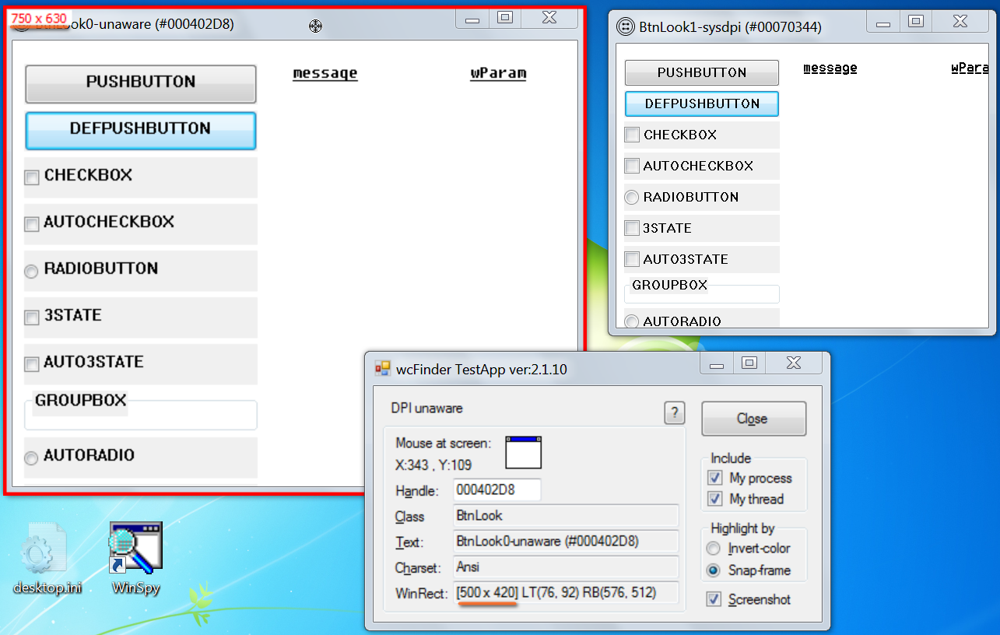
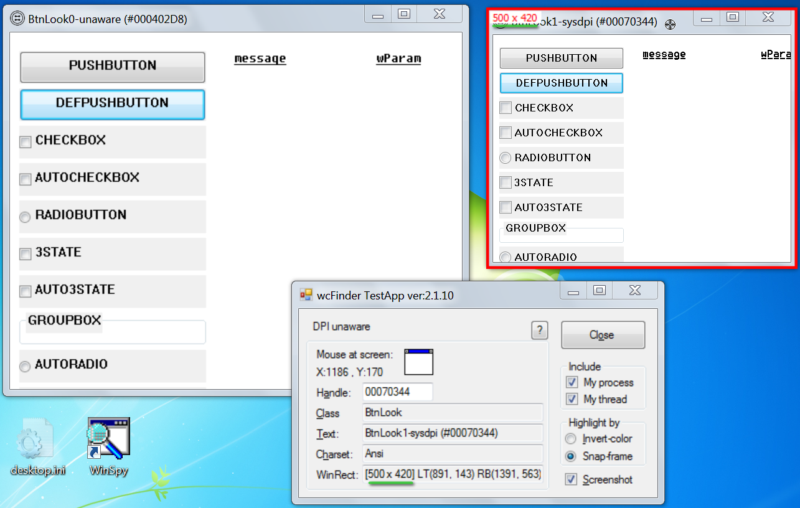
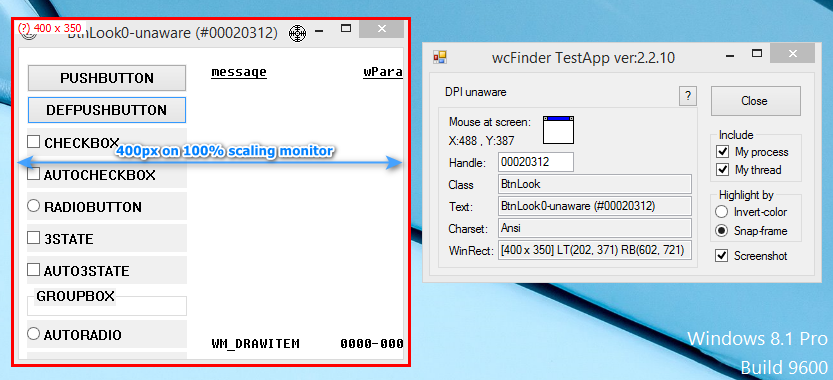
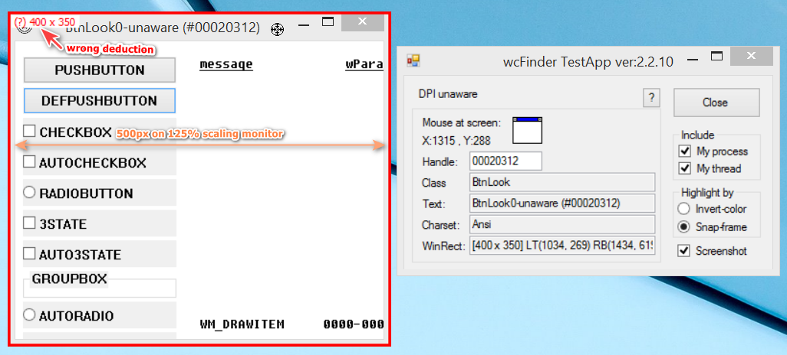

## Virtual coordinate vs Physical coordinate, of the Snap-frame.

* Virtual coordinate: The RECT value as returned by calling `GetWindowRect()`.
* Physical coordinate: The RECT value as measured by actual screen pixel.

Due to DPI-virtualization behavior for DPI-unaware and SysDpi-aware programs, such a program can see different Virtual coordinate and Physical coordinate for a specific HWND.

In order to show Physical width of the red Snap-frame(at left-top corner), *different* solutions should be applied for *different* Windows versions.

### Case 1: Windows 10.1607+

The solution is concise and clear, because Microsoft has finally supplied abundant APIs for mixmode DPI environment.

To get Physical coordinate of an HWND, the caller just temporarily switch itself to Per-monitor-aware context(`SetThreadDpiAwarenessContext`) before calling GetWindowRect(), and GetWindowRect returns exact physical coordinate.

### Case 2: Windows 7

We know that Win7 has the most fundamental high-DPI feature(all monitors must have consistent DPI scaling) and the least high-DPI API support, only `SetProcessDPIAware()` and `IsProcessDPIAware()` available.

There is a tough situation: When DPI-scaling is set to e.g. 150%, and, for example:

1. Our program is DPI-unaware.
2. There is another a DPI-unaware program with window A, and our program calling `GetWindowRect(hwndA)` returns virtual width 500. The window A is bitmap-stretched to 150% on physical screen so it actually has physical width 750.
3. There is a SysDpi-aware program with window B, and our program calling `GetWindowRect(hwndB)` also returns virtual width 500 . The window B is NOT bitmap-stretched so its physical width is 500 as well.

Then how can our program correctly deduce the widths of hwndA and hwndB? (In case our program is SysDpi-aware, the same problem exists.)

Windows 7 lacks API like `GetDpiForWindow()` for this purpose, and there is no Per-monitor-aware mode on Win7, so I call it tough.

As shown in the following figures, BtnLook0-unaware and BtnLook1-unaware has exactly the same program code, except that the latter is marked `<dpiAware>true</dpiAware>` in its manifest.

Fortunately, I have found a creative way to cope with it. Win7 has an API named `DwmGetWindowAttribute` that definitely reports **physical** coordinate of a top-level HWND. With the help of it, hwndA and hwndB's physical widths can be distinguished.

### Case 3: Windows 8.1 (including Windows 10 pre-1607)

Windows 8.1 is truely problematic. It has rudimentary *mixmode high-DPI* feature, i.e., it can choose different DPI-scaling for different monitor for us, but, it still lacks per-window API like `GetDpiForWindow`.

So, when the following two conditions are both met, physical coordinate of a target window CANNOT be reliably deduced. The wcFinder TestApp will show a question mark in such situation.

* Condition 1: wcFinder program itself is NOT Per-monitor-aware.
* Condition 2: Win81 has more than one monitor.

For example, monitor #1(primary) is 1024x768 with 100% scaling, monitor 2(secondary) is 1280*1024 with 125% scaling. Physical width of BtnLook0-unaware will be different when its window is on monitor #1 vs on monitor #2. However, DPI-unaware wcFinder will always deduce the same physical width for BtnLook window no matter which monitor BtnLook resides.

Frankly, I have not found a way to cope with this situation on Win81.
